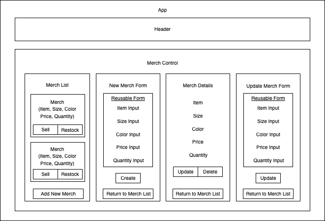

# 
 💃 🤘 **Merch Site** 🤘 🕺 

_May 28, 2022_

#### _React merch website with full CRUD capability for the ficticious funk metal band Our Guy Al_

#### By _**Phil Curran, Chris Depastene, Cesar Lopez, Christen Weston, John Whitten**_

## Table of Contents

1. [Description](#description)
2. [Technologies Used](#technologies)
3. [Setup/Installation Requirements](#setup)
4. [Known Bugs](#bugs)
5. [Contact Information](#contact)
6. [License](#license)

## Description 

This is a practice exercise for making a React website with full CRUD functionality. The application should allow users to create, read, update, and delete items in the store. Items should have fields for name, description, and quantity (along with any other fields you wish to add).

Increase or decrease the quantity of an item in the store. For instance, if a user clicks "Buy", the quantity will decrease by one. If a user clicks "Restock", it will increment by a specified number.

When the quantity of an item is reduced to 0, the item should say "Out of Stock". A user should not be able to reduce the quantity of an item below 0.

#### _Further Exploration_
Create a Cart component. When a user clicks "Buy", the specified item should be added to the cart.

A user should be able to view and remove items from the cart.

Create a widget that shows the number of items in the cart. This widget should be updated when items are added to the cart.

## Website Components Planning

## Technologies Used 

* HTML
* CSS
* JavaScript/JSX
* NPM
* Webpack

## Project Setup/Installation Instructions 

* Navigate to the directory in which you would like to clone this project.
* Run `git clone https://github.com/johnwhittenstudio/merch-site.git` in terminal.
* Run `cd merch-site` to navigate into new project directory.
* Open the cloned repo in a text editor of your choice.
* Run `npm install` to download all dependencies.
* Run `npm run start` to start a live server and view projec in the browser.
* Run `npm run test` to run tests.

## Known Bugs 

- _None._

## Contact 
Phil Curran - [Email](mailto:pecurran@hotmail.com) • [LinkedIn](https://www.linkedin.com/in/philcurran/) • [GitHub](https://github.com/phil-curran)  
Chris Depastene - [Email](mailto:cdepastene@gmail.com) • [LinkedIn](https://www.linkedin.com/in/christopherdepastene/) • [GitHub](https://github.com/chrisdfghjkl)  
Cesar Lopez - [Email](mailto:lopez.cesar.aug@gmail.com) • [LinkedIn](https://www.linkedin.com/in/cesar-aug-lopez/) • [GitHub](https://github.com/wowgr8)  
Christen Weston - [Email](mailto:johnwhitten.studio@gmail.com) • [LinkedIn](https://www.linkedin.com/in/johnwhitten-studio/) • [GitHub](https://github.com/johnwhittenstudio)  
John Whitten - [Email](mailto:johnwhitten.studio@gmail.com) • [LinkedIn](https://www.linkedin.com/in/johnwhitten-studio/) • [GitHub](https://github.com/johnwhittenstudio)

## License 

Copyright (c) 2022 _**Phil Curran, Chris Depastene, Cesar Lopez, Christen Weston, John Whitten**_

Permission is hereby granted, free of charge, to any person obtaining a copy of this software and associated documentation files (the "Software"), to deal in the Software without restriction, including without limitation the rights to use, copy, modify, merge, publish, distribute, sublicense, and/or sell copies of the Software, and to permit persons to whom the Software is furnished to do so, subject to the following conditions:

The above copyright notice and this permission notice shall be included in all copies or substantial portions of the Software.

THE SOFTWARE IS PROVIDED "AS IS", WITHOUT WARRANTY OF ANY KIND, EXPRESS OR IMPLIED, INCLUDING BUT NOT LIMITED TO THE WARRANTIES OF MERCHANTABILITY, FITNESS FOR A PARTICULAR PURPOSE AND NONINFRINGEMENT. IN NO EVENT SHALL THE AUTHORS OR COPYRIGHT HOLDERS BE LIABLE FOR ANY CLAIM, DAMAGES OR OTHER LIABILITY, WHETHER IN AN ACTION OF CONTRACT, TORT OR OTHERWISE, ARISING FROM, OUT OF OR IN CONNECTION WITH THE SOFTWARE OR THE USE OR OTHER DEALINGS IN THE SOFTWARE.